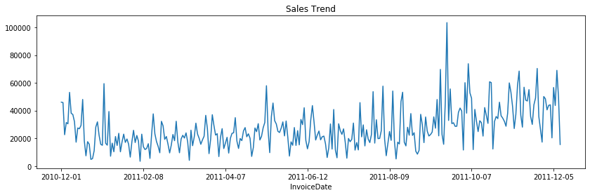
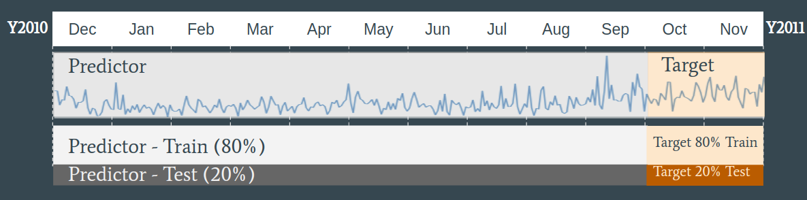
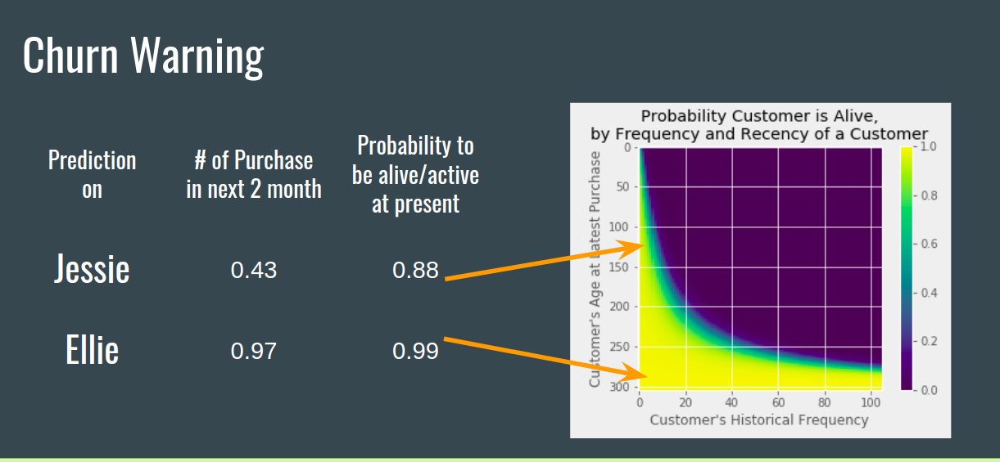

# Analysis on Customer Lifetime Value
----------
By Vince Pan

-----------------------

# Table of Contents
[1. Background](#Background)  
[2. Methodology](#Methodology)  
>   [2.1. Brief walkthrough](#bw) 
>   [2.2. Project setting](#ps) 
    
[3. Model](#Model)
> [3.1. Data preprocessing](#Model) 
> [3.2. CLTV Model](#cm) 

[4. Applications](#Applications)
> [4.1. Who’s VIP](#Applications) 
> [4.2. Churn Alarm](#ca) 

[5. Summary](#sm)

[6. Appendix](#Appendix)

-----------------------

# Background

## Motivation

In marketing, one question often being asked is what is a **C**ustomer **L**ife**T**ime **V**alue(CLTV or LTV). 

CLTV is a great tool to quantify marketing events, and able to help
* Determine new customer acquisition spend
* Evaluating marketing campaign ROI
* Prioritize customer support resource
* Even for sales prediction

## Definition

By definition

> **Customer lifetime value** is the present value of the future (net) cash flows associated with the customer.

In practice, we usually simplify the question to 

**How much will the customer buy in the future?**

In this study, we define the CLTV of a customer as the future spending(long term of a time range) of the customer from present.

----------

# Methodology

The problem of CLTV is a forecasting problem which often could be modelled with supervised machine learning methods in Data Science. However, it would be much more interpretable and straightforward if we modeled in a statistical model. 

Back in 1987, the first probabilistic model able to estimate customer future purchase was made by Schmittlein, Morrison, and Colombo. Then in 1999, Colombo and Jiang developed the gamma-gamma customer spending model which completes the customer lifetime value theory.

## Brief walkthrough

The essential idea of CLTV modelling is to decompose the total spending of a customer

> Total Sales = Number of transactions * Single transaction amount
> = Number of transaction in Unit time * Customer Purchasing Lifetime Length * Single Transaction Amount

Each element is following a common probability distribution.

> * Number of transaction in Unit time ~ Poisson Distribution
> * Customer Purchasing Lifetime Length ~ Exponential Distribution
> * Single Transaction Amount ~ Gamma Distribution

We could utilize the customer purchasing history to estimate the distribution parameters. For detailed derivation, please refer to the papers in the appendix.

## Project setting

We are going to apply the CLTV model to a real-life e-commerce case and compare CLTV model’s performance to traditional supervised learning methods including Random Forest, OLS, etc.

# Model

## Data preprocessing

### Data Source

We use a typical transactional dataset which includes the person, time and amount of the transaction. The dataset describes all transaction records for a UK-based and registered non-store online retail which can also be found in https://www.kaggle.com/carrie1/ecommerce-data.
 
The original dataset was not extracted with the purpose of CLTV study. We truncate the date range into 12 month and keep the purchasing history with below features.
 
Date Range: 2010-12-01 ~ 2011-11-30
Features: 
‘Purchase Date, Customer ID, Purchase Amount’
 
 
### EDA
 
Data points: 406829
Number of Transactions*: 19296
Number of customer: 4372
Average Transaction Amount: 430
 
* Note: One transaction is defined as the aggregation of all purchased records made in the same day.
 
The total sales of the company does not have a clear trend but there is a surge in Winter.

> 
 
 
### Train-Test Split
In order to make the data fit into our CLTV, we divided the dataset by time. The first 10 month data were treated as our training data and the last two month as our target or test set.
 
For comparison with supervised methods, we divided the training set into 8:2 in months to set up the predictor and target.
 
> 

## CLTV Model

### Feature Engineering

Similar to the classical marketing segmentation method, the CLTV model only rely on the RFM metrics of customer previous purchases. 

Here are the features we need:
Recency:
* T:   represents the age of the customer in present time, i.e. how many days since his first purchase
* R:  represents the age of the customer when they made their most recent purchases, , i.e. how many days since his first purchase

F for Frequency: represents the number of repeat purchases the customer has made, i.e. how many purchases he made after the first one
M for Monetery: represents the average value of a given customer’s purchases, i.e. average amount

We used the same feature for the CLTV model and other classical machine learning models.

### Model Stats

We use the RMSE(Rooted Mean Squared Error) to compare the performance of models. Please refer to the Jupyter notebook for detail modeling codes.

> RMSE = Squared Root of Summation of the Prediction Error

To compare with the most intuitive method of the prediction, we use the mean of customer lifetime monthly spend as our baseline.

| Method    |         Base         |     CLTV    | Supervised Learning |  Supervised Learning   |Supervised Learning   |
|-----------|:--------------------:|:----------:|:-------------------:|:-----------------:|:-----------------:|
| Algorithm | Lifetime monthly avg | Pareto/NBD |    Random Forest    | Linear Regression |Support Vector Machine |
| RMSE*     |         3140         |    1660    |         1808        |        1774       |2682 |

The CLTV model has the lowest RMSE which indicates it has the highest accuracy in prediction. Also the model has a strong interpretability for business applications. 

# Applications

## Who’s VIP

A general application of calculating customer value is that we want to prioritize our limited resource on the most valued customer.

The regular method for determining customer value by accumulated spending. However, a customer spent a big amount one year ago and no spending after that would have a lower expectation spending than people who spent the half amount twice recently. By CLTV model, we are able to tell who has a higher chance to come back and how much they will spend in a future period.

By ranking the future expense, we can tell who should be our VIP?

| Prediction on | # of Purchase | $ of Single Purchase | LTV |
|:-------------:|:-------------:|:--------------------:|:---:|
|     Jessie    |      0.43     |          179         |  78 |  
|     Ellie     |      0.97     |          74          |  72 |   
|     ...      |       ...     |       ...          |  ...   |   
|    Calli    |       0.07     |           54         |   4  |   

## Churn Alarm

Another major usage of this model is to assess the probability the customer is still alive with our business which here alive indicates they will buy in the future.

Here is an example for two customers.

> 

In this situation, we need to be aware that Jessie is likely to leave our business. We might need extra communication or an retention offer to trigger he came back.

# Summary

## Takeaways

* CLTV model reduces bias in customer spending prediction than using the mean.
* CLTV helps identify the most value customer
* Alternative way to predict churn

## What’s next
* Integrate with Churn Prediction. Would it be a good way to fill in the cost-benefit matrix? 
* Expend the model to include more transactional information, i.e. what they buy.

# Appendix

## Thanks to
Pareto/NBD “Counting Your Customers” framework proposed by Schmittlein, Morrison, and Colombo (1987) 

The Gamma-Gamma Model of Monetary Value
Peter S. Fader, Bruce G. S. Hardie February 2013
http://brucehardie.com/notes/025/gamma_gamma## Thanks to
Pareto/NBD “Counting Your Customers” framework proposed by Schmittlein, Morrison, and Colombo (1987) 

The Gamma-Gamma Model of Monetary Value
Peter S. Fader, Bruce G. S. Hardie February 2013
http://brucehardie.com/notes/025/gamma_gamma
